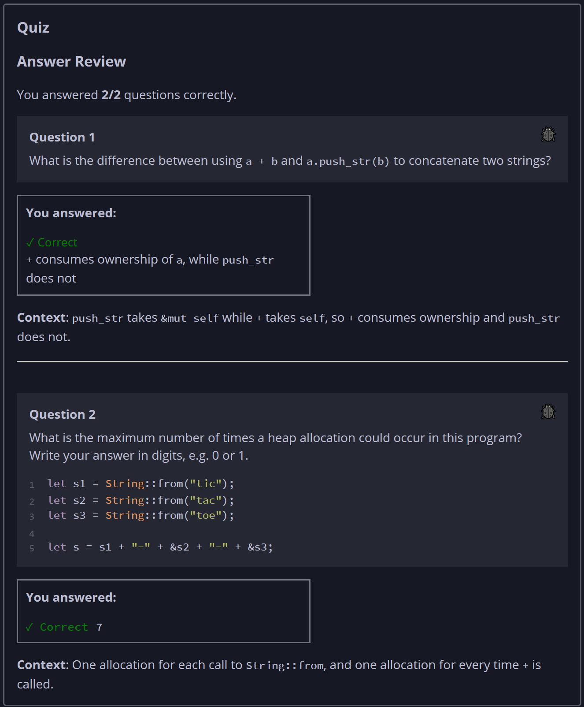

## Quiz - Chapter 8.2a ##

> ---
> **Question 1**<br>
> What is the difference between using ```a + b``` and
> ```a.push_str(b)``` to concatenate two strings?
>
> > Response<br>
> > ○ ```push_str``` is more efficient at runtime than
> > ```+```<br>
> > ◉ ```+``` consumes ownership of a, while ```push_str``` 
> > does not<br>
> > ○ There is no difference, they are aliases for the same 
> > function<br>
> > ○ ```push_str``` consumes ownership of b, while ```+``` 
> > does not<br>
> > 
> ---
> 
> **Question 2**<br>
> What is the maximum number of times a heap allocation could 
> occur in this program? Write your answer in digits, e.g. 0 
> or 1.
>
> ```rust
> let s1 = String::from("tic");
> let s2 = String::from("tac");
> let s3 = String::from("toe");
> let s = s1 + "-" + &s2 + "-" + &s3;
> ```
>
> > Response<br>
> > [ ```5``` ]
> > 
> ---


