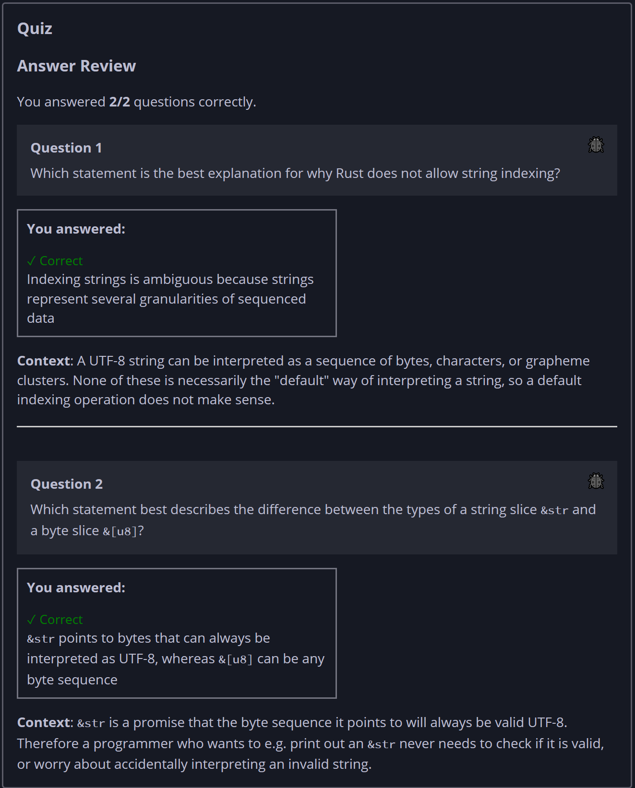

## Quiz - Chapter 8.2b ##

> ---
> **Question 1**<br>
> Which statement is the best explanation for why Rust does 
> not allow string indexing?
>
> > Response<br>
> > ○ Indexing strings is unsafe because it can cause a 
> > segfault or buffer overflow<br>
> > ○ Indexing strings is inefficient because string are 
> > null-terminated so their length cannot be efficiently 
> > computed<br>
> > ◉ Indexing strings is ambiguous because strings represent 
> > several granularities of sequenced data<br>
> > ○ Indexing strings would make Rust too easy to use, and 
> > Rust developers need job security<br>
> >
> ---
>
> **Question 2**<br>
> Which statement best describes the difference between the 
> types of a string slice ```&str``` and a byte slice
> ```&[u8]```?
>
> > Response<br>
> > ○ ```&str``` can be constructed from a ``String``, while
> > ```&[u8]``` can only come from a ```Vec```<br>
> > ◉ ```&str``` points to bytes that can always be 
> > interpreted as UTF-8, whereas ```&[u8]``` can be any byte 
> > sequence<br>
> > ○ ```&str``` always points to data stored in the program 
> > binary, whereas ```&[u8]``` can be stored anywhere in 
> > memory<br>
> > ○ ```&str``` cannot be further sliced, while ```&[u8]``` 
> > can be sliced again<br>
> >
> ---


