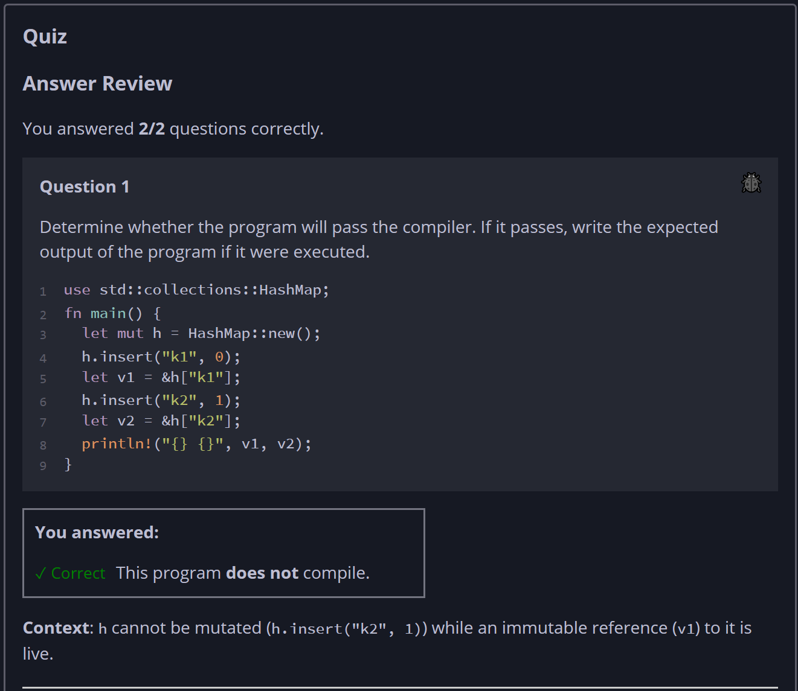
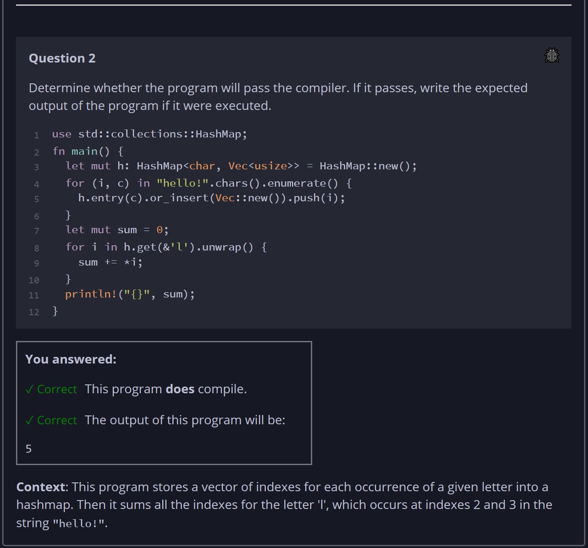

## Quiz - Chapter 8.3 ##

> ---
> **Question 1**<br>
> Determine whether the program will pass the compiler. If it 
> passes, write the expected output of the program if it were 
> executed.
>
> ```rust
> use std::collections::HashMap;
> fn main() {
>     let mut h = HashMap::new();
>     h.insert("k1", 0);
>     let v1 = &h["k1"];
>     h.insert("k2", 1);
>     let v2 = &h["k2"];
>     println!("{} {}", v1, v2);
> }
> ```
>
> > Response<br>
> > This program:<br>
> > ○ DOES compile<br>
> > ◉ Does NOT compile<br>
>
> ---
> 
> **Question 2**<br>
> Determine whether the program will pass the compiler. If it 
> passes, write the expected output of the program if it were 
> executed.
>
> ```rust
> use std::collections::HashMap;
> fn main() {
>     let mut h = HashMap::new();
>     h.insert("k1", 0);
>     let v1 = &h["k1"];
>     h.insert("k2", 1);
>     let v2 = &h["k2"];
>     println!("{} {}", v1, v2);
> }
> ```
>
> > Response<br>
> > This program:<br>
> > ◉ DOES compile<br>
> > ○ Does NOT compile<br>
> > 
> > The output of this program will be:<br>
> > [```5```]
> > 
> ---
>



