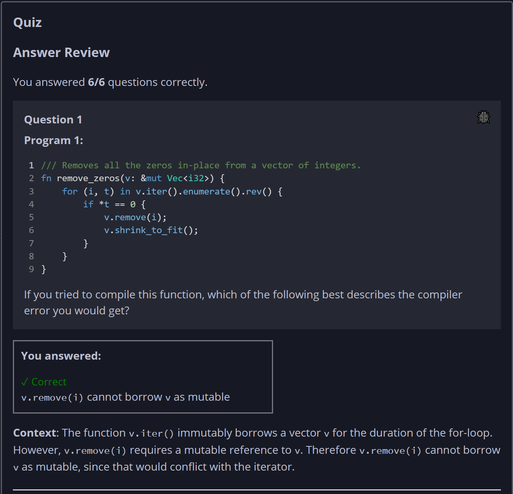
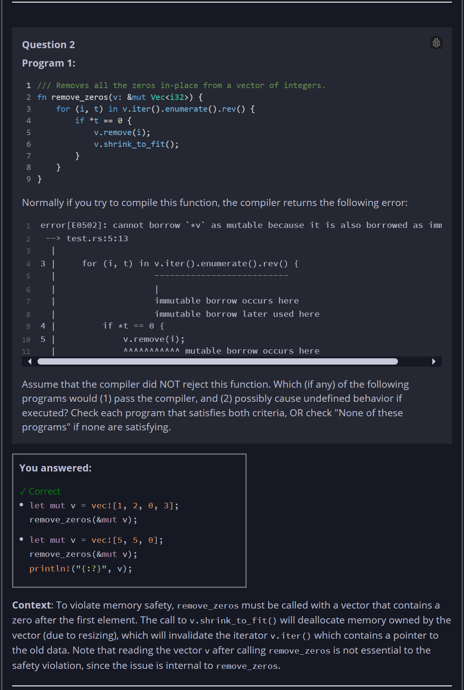
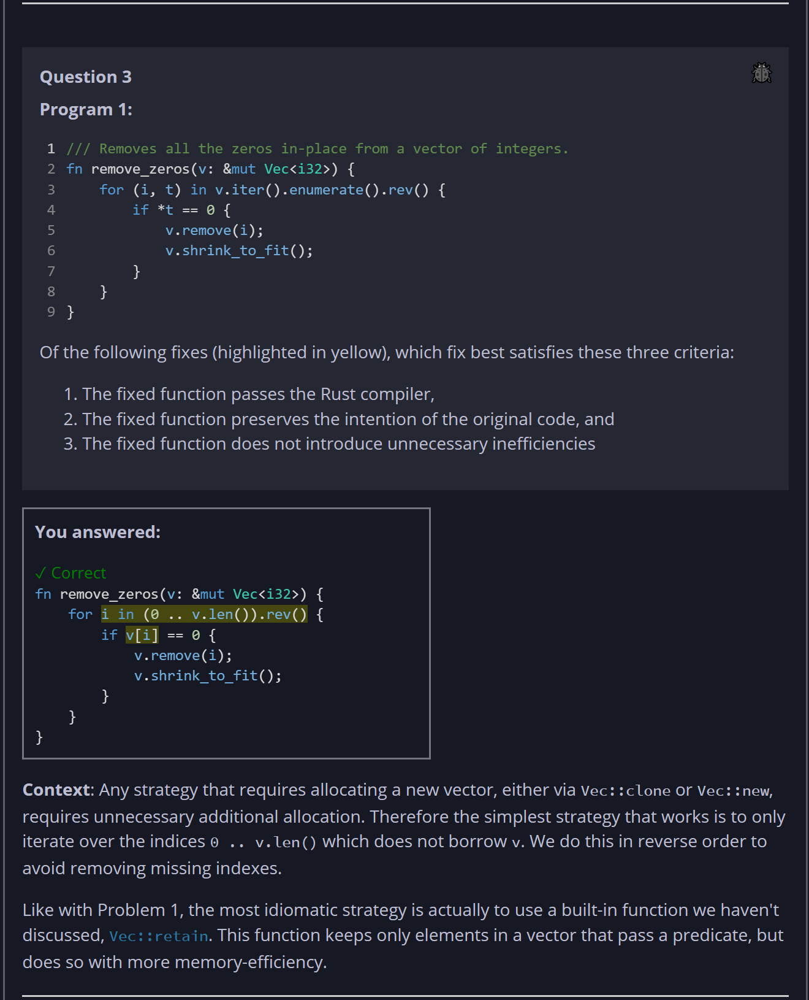
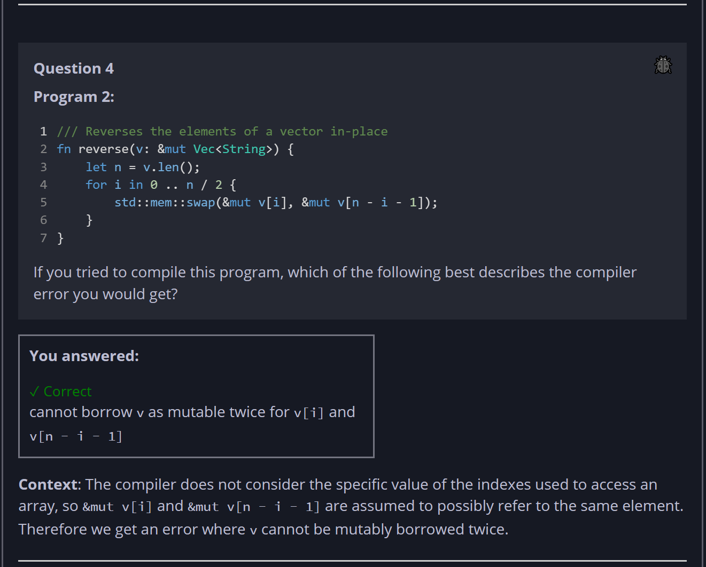
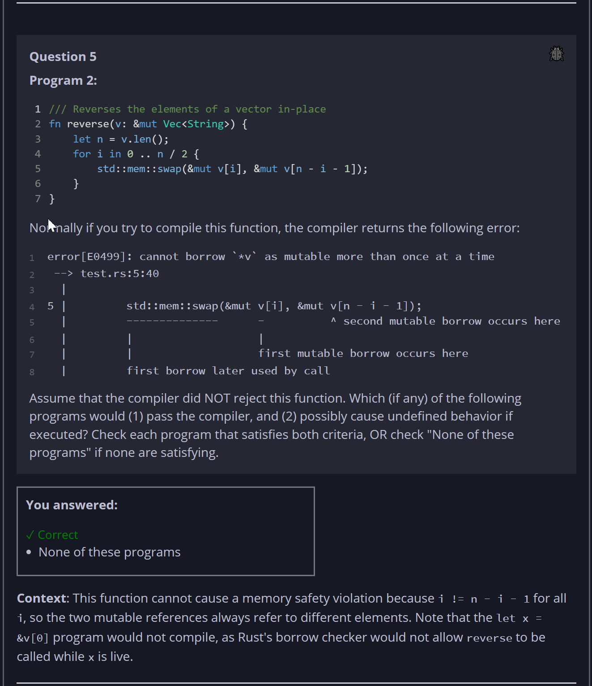
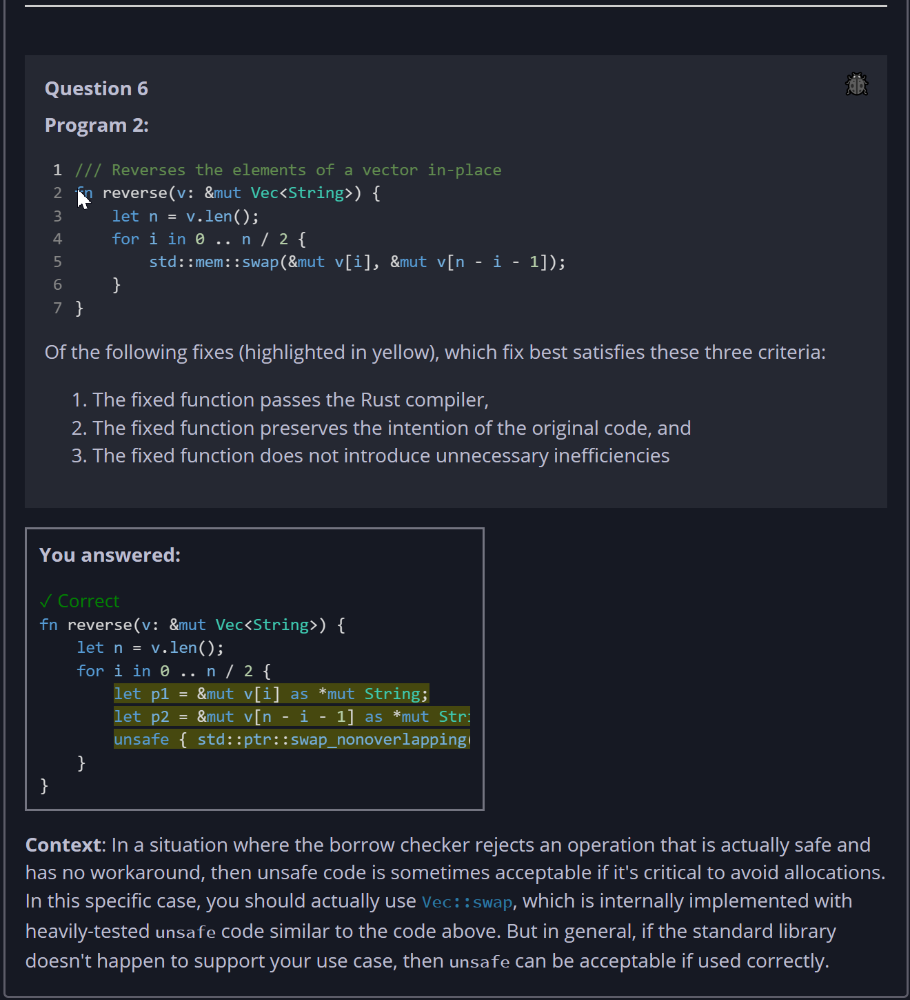

## Quiz - Chapter 8.3 - Ownership Inventory #2 ##

> ---
> **Question 1**<br>
> Program 1:
> 
> ```rust
> /// Removes all the zeros in-place from a vector of integers.
> fn remove_zeros(v: &mut Vec<i32>) {
>     for (i, t) in v.iter().enumerate().rev() {
>         if *t == 0 {
>             v.remove(i);
>             v.shrink_to_fit();
>         }
>     }
> }
> ```
> 
> If you tried to compile this function, which of the 
> following best describes the compiler error you would get?
>
> > Response<br>
> > ○ ```t``` cannot be dereferenced while ```i``` is live<br>
> > ◉ ```v.remove(i)``` cannot borrow ```v``` as mutable<br>
> > ○ ```v.iter()``` cannot be called on a mutable 
> > reference<br>
> > ○ ```v``` does not live long enough to call 
> > ```v.remove(i)```<br>
> >
> ---
>
> **Question 2**<br>
> Program 1:
> 
> ```rust
> /// Removes all the zeros in-place from a vector of integers.
> fn remove_zeros(v: &mut Vec<i32>) {
>     for (i, t) in v.iter().enumerate().rev() {
>         if *t == 0 {
>             v.remove(i);
>             v.shrink_to_fit();
>         }
>     }
> }
> ```
>
> Normally if you try to compile this function, the compiler 
> returns the following error:
>
> ```
> error[E0502]: cannot borrow `*v` as mutable because it is also borrowed as immutable
>  --> test.rs:5:13
>   |
> 3 |     for (i, t) in v.iter().enumerate().rev() {
>   |                   --------------------------
>   |                   |
>   |                   immutable borrow occurs here
>   |                   immutable borrow later used here
> 4 |         if *t == 0 {
> 5 |             v.remove(i);
>   |             ^^^^^^^^^^^ mutable borrow occurs here
> ```
> Assume that the compiler did NOT reject this function. 
> Which (if any) of the following programs would (1) pass the 
> compiler, and (2) possibly cause undefined behavior if 
> executed? Check each program that satisfies both criteria, 
> OR check "None of these programs" if none are satisfying.
>
> > Response<br>
> > ☐ None of these programs<br>
> > 
> > ---
> > ☑ 
> > ```rust
> > let mut v = vec![1, 2, 0, 3];
> > remove_zeros(&mut v);
> > ```
> > ---
> > ☑ 
> > ```rust
> > let mut v = vec![5, 5, 0];
> > remove_zeros(&mut v);
> > println!("{:?}", v);
> > ```
> > ---
> > ☐ 
> > ```rust
> > let mut v = vec![1; 100];
> > remove_zeros(&mut v);
> > ```
> > ---
> >
> ---
>
> **Question 3**<br>
> Program 1:
> 
> ```rust
> /// Removes all the zeros in-place from a vector of integers.
> fn remove_zeros(v: &mut Vec<i32>) {
>     for (i, t) in v.iter().enumerate().rev() {
>         if *t == 0 {
>             v.remove(i);
>             v.shrink_to_fit();
>         }
>     }
> }
> ```
> 
> Of the following fixes (highlighted in yellow), which fix 
> best satisfies these three criteria:
> 
> 1. The fixed function passes the Rust compiler,
> 2. The fixed function preserves the intention of the 
>    original code, and
> 3. The fixed function does not introduce unnecessary 
>    inefficiencies
> 
> > Response<br>
> > ◉
> > ```rust
> > fn remove_zeros(v: &mut Vec<i32>) {
> >     for i in (0 .. v.len()).rev() {
> >         if v[i] == 0 {
> >             v.remove(i);
> >             v.shrink_to_fit();
> >         }
> >     }
> > }
> > ```
> > ---
> > ○
> > ```rust
> > fn remove_zeros(v: &Vec<i32>) -> Vec<i32> {
> >     let mut new_vec = Vec::new();
> >     for (i, t) in v.iter().enumerate().rev() {
> >         if *t != 0 {
> >             new_vec.push(*t)
> >         }
> >     }
> >     new_vec
> > }
> > ```
> > ---
> > ○
> > ```rust
> > fn remove_zeros(v: Vec<i32>) {
> >     for (i, t) in v.iter().enumerate().rev() {
> >         if *t == 0 {
> >             v.remove(i);
> >             v.shrink_to_fit();
> >         }
> >     }
> > }
> > ```
> > ---
> > ○
> > ```rust
> > fn remove_zeros(v: &mut Vec<i32>) {
> >     for (i, t) in v.clone().iter().enumerate().rev() {
> >         if *t == 0 {
> >             v.remove(i);
> >             v.shrink_to_fit();
> >         }
> >     }
> > }
> > ```
> > ---
> >
> ---
>
> **Question 4**<br>
> Program 2:
> 
> ```rust
> /// Reverses the elements of a vector in-place
> fn reverse(v: &mut Vec<String>) {
>     let n = v.len();
>     for i in 0 .. n / 2 {
>         std::mem::swap(&mut v[i], &mut v[n - i - 1]);
>     }
> }
> ```
>
> If you tried to compile this program, which of the 
> following best describes the compiler error you would get?
> 
> > Response<br>
> > ◉ cannot borrow ```v``` as mutable twice for ```v[i]``` 
> > and ```v[n - i - 1]```<br>
> > ○ cannot borrow ```v``` as immutable for ```v.len()``` 
> > when ```v``` is a mutable borrow<br>
> > ○ cannot mutably borrow an element ```v[i]``` of a 
> > mutable vector<br>
> > 
> ---
>
> **Question 5**<br>
> Program 2:
> 
> ```rust
> /// Reverses the elements of a vector in-place
> fn reverse(v: &mut Vec<String>) {
>     let n = v.len();
>     for i in 0 .. n / 2 {
>         std::mem::swap(&mut v[i], &mut v[n - i - 1]);
>     }
> }
> ```
>
> Normally if you try to compile this function, the compiler 
> returns the following error:
> ```
> error[E0499]: cannot borrow `*v` as mutable more than once at a time
>  --> test.rs:5:40
>   |
> 5 |         std::mem::swap(&mut v[i], &mut v[n - i - 1]);
>   |         --------------      -          ^ second mutable borrow occurs here
>   |         |                   |
>   |         |                   first mutable borrow occurs here
>   |         first borrow later used by call
> ```
>
> Assume that the compiler did NOT reject this function. 
> Which (if any) of the following programs would (1) pass the 
> compiler, and (2) possibly cause undefined behavior if 
> executed? Check each program that satisfies both criteria, 
> OR check "None of these programs" if none are satisfying.
>
> > Response<br>
> > ---
> > ☐ 
> > ```rust
> > let mut v = vec![String::from("a"), String::from("b")];
> > let x = &v[0];
> > reverse(&mut v);
> > println!("{x}");
> > ```
> > ---
> > ☐ 
> > ```rust
> > let mut v = vec![String::from("a"), String::from("b")];
> > reverse(&mut v);
> > println!("{:?}", v);
> > ```
> > ---
> > 
> > ☑ None of these programs<br>
> > 
> > ---
> > ☐ 
> > ```rust
> > let mut v = vec![String::from("a"), String::from("b")];
> > reverse(&mut v);
> > ```
> > ---
> >
> ---
>
> **Question 6**<br>
> Program 2:
> 
> ```rust
> /// Reverses the elements of a vector in-place
> fn reverse(v: &mut Vec<String>) {
>     let n = v.len();
>     for i in 0 .. n / 2 {
>         std::mem::swap(&mut v[i], &mut v[n - i - 1]);
>     }
> }
> ```
> 
> Of the following fixes (highlighted in yellow), which fix 
> best satisfies these three criteria:
> 
> 1. The fixed function passes the Rust compiler,
> 2. The fixed function preserves the intention of the 
>    original code, and
> 3. The fixed function does not introduce unnecessary 
>    inefficiencies
> 
> > Response<br>
> > ◉
> > ```rust
> > fn reverse(v: &mut Vec<String>) {
> >     let n = v.len();
> >     for i in 0 .. n / 2 {
> >         let p1 = &mut v[i] as *mut String;
> >         let p2 = &mut v[n - i - 1] as *mut String;
> >         unsafe { std::ptr::swap_nonoverlapping(p1, p2, 1); }
> >     }
> > }
> > ```
> > ---
> > ○
> > ```rust
> > fn reverse(v: &mut Vec<String>) {
> >     let n = v.len();    
> >     for i in 0 .. n / 2 {
> >         let s1 = v[i].clone();
> >         let s2 = v[n - i - 1].clone();
> >         v[i] = s2;
> >         v[n - i - 1] = s1;
> >     }
> > }
> > ```
> > ---
> > ○
> > ```rust
> > fn reverse(v: &mut Vec<String>) {
> >     let n = v.len();
> >     let mut v2 = v.clone();
> >     for i in 0 .. n / 2 {
> >         std::mem::swap(&mut v[i], &mut v2[n - i - 1]);
> >     }
> > }
> > ```
> > ---
> > ○
> > ```rust
> > fn reverse(v: &Vec<String>) -> Vec<String> {
> >     let n = v.len();
> >     let mut v2 = Vec::new();    
> >     for _ in 0 .. n {
> >         v2.push(v.pop().unwrap());
> >     }
> >     v2
> > }
> > ```
> > ---
> >
> ---







