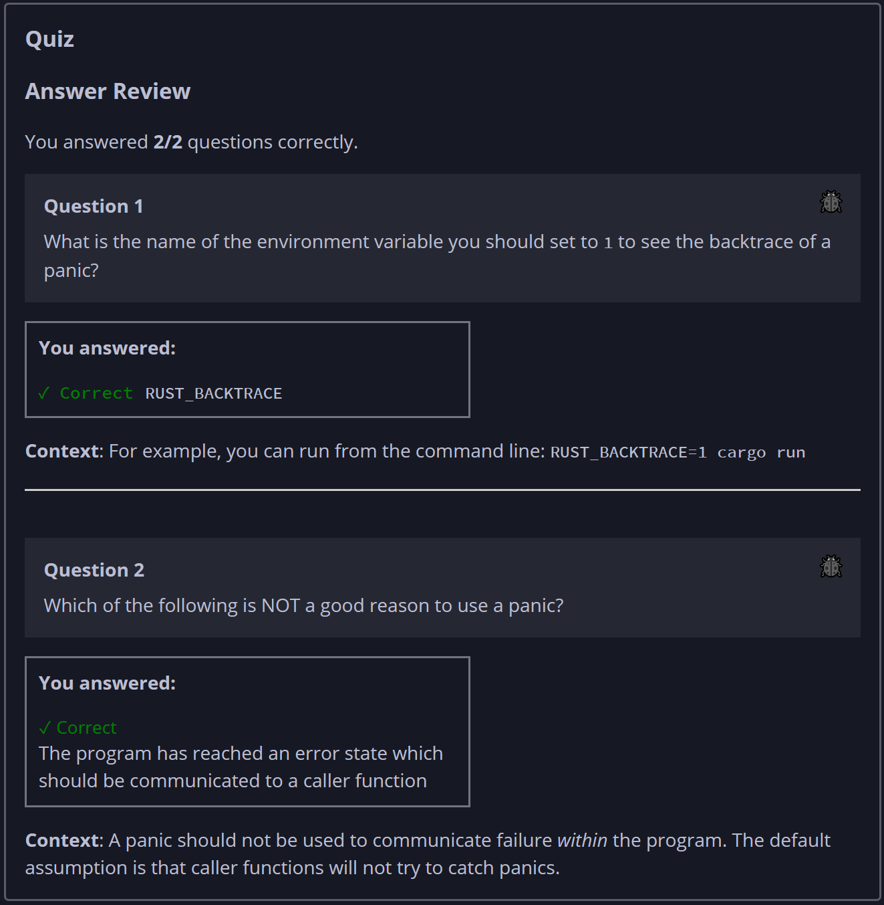

## Quiz - Chapter 9.1 ##

> ---
> **Question 1**<br>
> What is the name of the environment variable you should set 
> to 1 to see the backtrace of a panic?
>
> > Response<br>
> > [ ```RUST_BACKTRACE``` ]
> >
> ---
>
> **Question 1**<br>
> Which of the following is NOT a good reason to use a panic?
>
> > Response<br>
> > ○ The program has reached an unrecoverable error state<br>
> > ○ The program should stop executing as soon as 
> > possible<br>
> > ○ The program is about to perform a dangerous 
> > operation<br>
> > ◉ The program has reached an error state which should be 
> > communicated to a caller function<br>
> >
> ---


