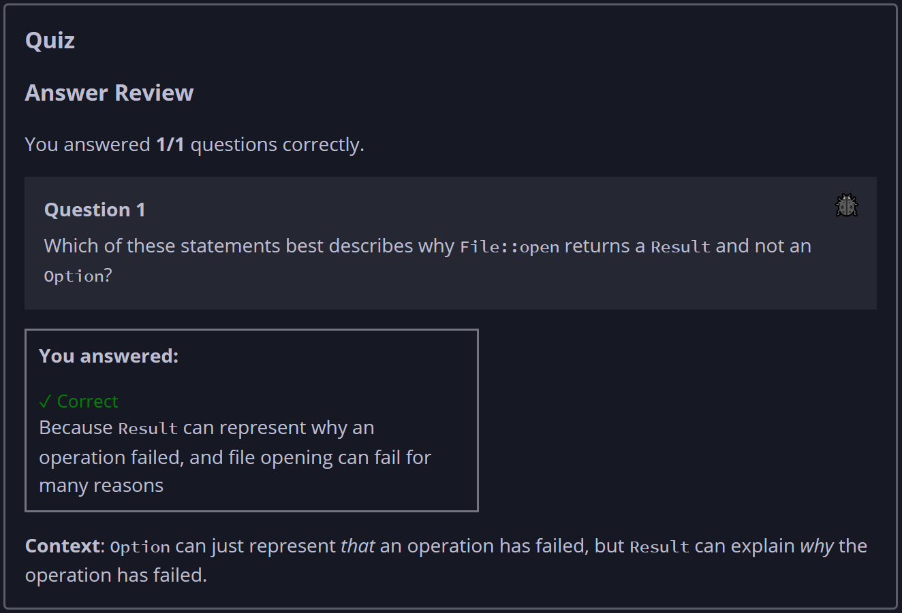

## Quiz - Chapter 9.2a ##

> ---
> **Question 1**<br>
> Which of these statements best describes why 
> ```File::open``` returns a ```Result``` and not an 
> ```Option```?
>
> > Result<br>
> > ○ Because ```Result``` represents the possibility of 
> > failure, while ```Option``` cannot represent failures<br>
> > ◉ Because ```Result``` can represent why an operation 
> > failed, and file opening can fail for many reasons<br>
> > ○ Because ```Result``` represents errors the same way as 
> > the underlying system calls<br>
> > ○ Because ```Result``` uses fewer bytes at runtime than 
> > ```Option``` to represent failures<br>
> >
> ---


