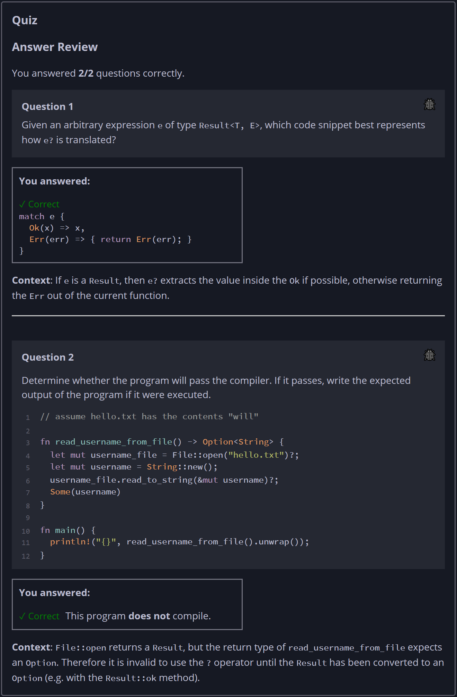

## Quiz - Chapter 9.2b ##

> ---
> **Question 1**<br>
> Given an arbitrary expression ```e``` of type 
> ```Result<T, E>```, which code snippet best represents how 
> ```e```? is translated?
>
> > Response<br>
> > ○
> > ```rust
> > e.unwrap()
> > ```
> > ---
> > ○
> > ```rust
> > if let Err(err) = e {
> >     return Err(err);
> > }
> > ```
> > ---
> > ◉
> > ```rust
> > match e {
> >     Ok(x) => x,
> >     Err(err) => { return Err(err); }
> > }
> > ```
> > ---
> > ○
> > ```rust
> > match e {
> >     Ok(x) => x,
> >     Err(err) => panic!("{err}")
> > }
> > ```
> > ---
> >
> ---
> 
> **Question 2**<br>
> Determine whether the program will pass the compiler. If it 
> passes, write the expected output of the program if it were 
> executed.
>
> > Response<br>
> > 
> > ```rust
> > // assume hello.txt has the contents "will"
> > 
> > fn read_username_from_file() -> Option<String> {
> >     let mut username_file = File::open("hello.txt")?;
> >     let mut username = String::new();
> >     username_file.read_to_string(&mut username)?;
> >     Some(username)
> > }
> > 
> > fn main() {
> >     println!("{}", read_username_from_file().unwrap()); 
> > }
> > ```
> > 
> > This program:<br>
> > ○ DOES compile<br>
> > ◉ Does NOT compile<br>
> >
> ---


