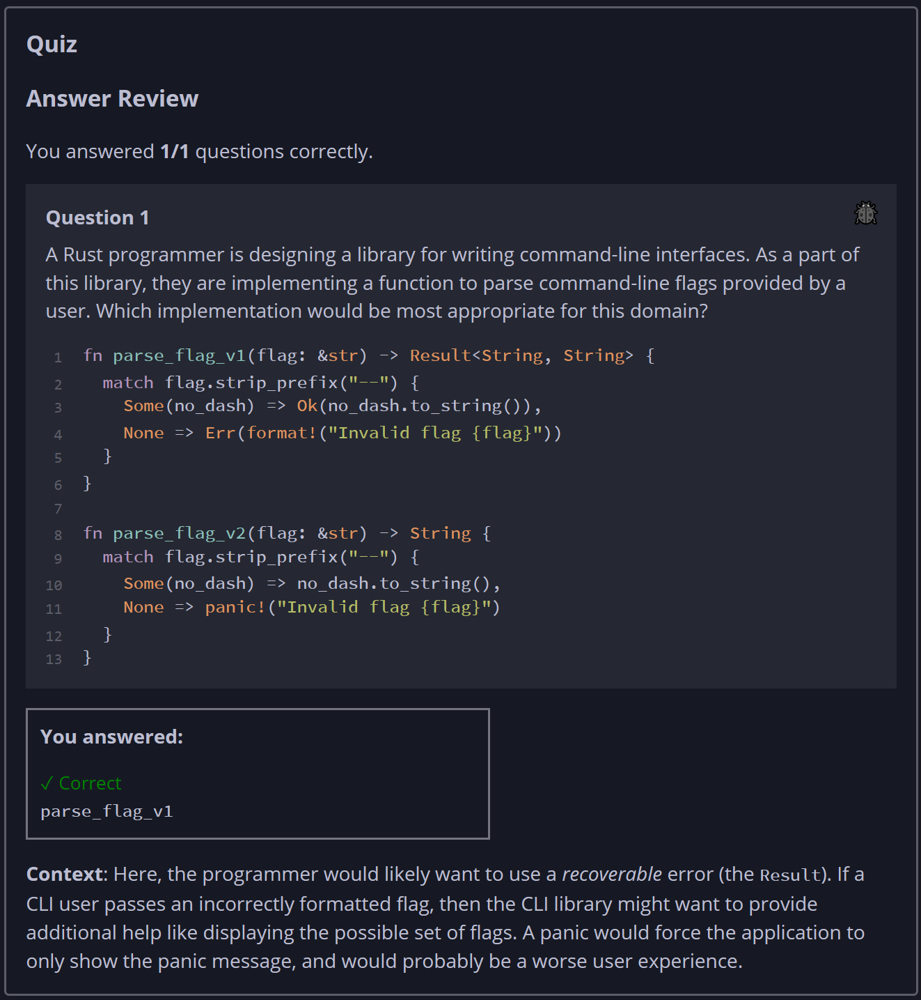

## Quiz - Chapter 9.3 ##

> ---
> **Question 1**<br>
> A Rust programmer is designing a library for writing 
> command-line interfaces. As a part of this library, they 
> are implementing a function to parse command-line flags 
> provided by a user. Which implementation would be most 
> appropriate for this domain?
> 
> ```rust
> fn parse_flag_v1(flag: &str) -> Result<String, String> {
>     match flag.strip_prefix("--") {
>         Some(no_dash) => Ok(no_dash.to_string()),
>         None => Err(format!("Invalid flag {flag}"))
>     }
> }
> 
> fn parse_flag_v2(flag: &str) -> String {
>     match flag.strip_prefix("--") {
>         Some(no_dash) => no_dash.to_string(),
>         None => panic!("Invalid flag {flag}")
>     }
> }
> ```
>
> > Response<br>
> > ◉ ```parse_flag_v1```<br>
> > ○ ```parse_flag_v2```<br>
> > 
> ---


