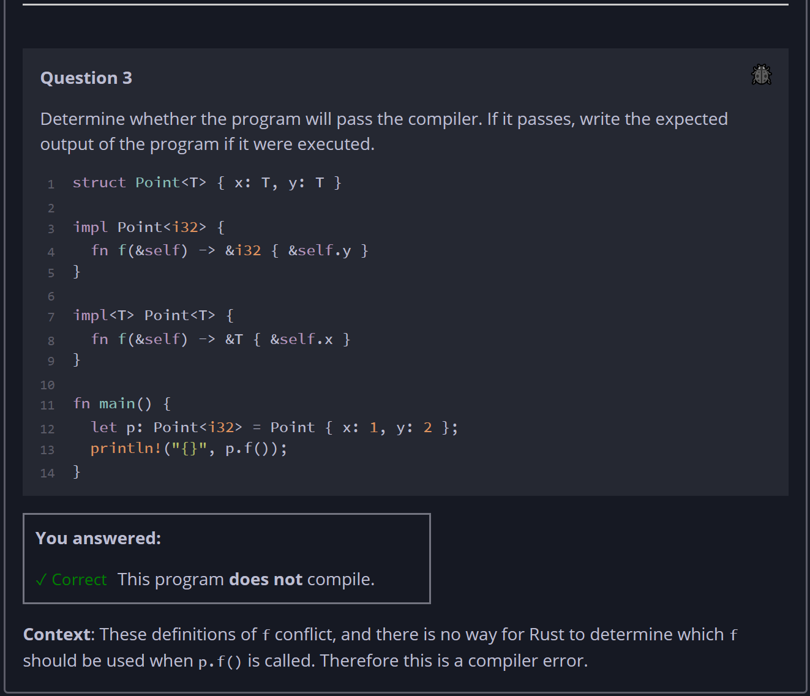

## Quiz - Chapter 10.1 ##

> **Question 1**<br>
> Imagine using a third-party function whose implementation 
> you don't know, but whose type signature is this:
>
> ```rust
> fn mystery<T>(x: T) -> T {
>     // ????
> }
> ```
> Then you call ```mystery``` like this:
> 
> ```rust
> let y = mystery(3);
> ```
> 
> Assuming ```mystery``` uses no unsafe code, then the value 
> of ```y``` must be:
>
> > Response<br>
> > [ ```3``` ]
> >
> ---
>
> **Question 2**<br>
> Determine whether the program will pass the compiler. If it 
> passes, write the expected output of the program if it were 
> executed.
> ```rust
> fn print_slice<T>(v: &[T]) {
>     for x in v {
>         println!("{x}");
>     }
> }
> 
> fn main() {
>     print_slice(&[1, 2, 3]);
> }
> ```
>
> > Response<br>
> > This program:<br>
> > ○ DOES compile<br>
> > ◉ Does NOT compile<br>
> > 
> ---
>
> **Question 3**<br>
> Determine whether the program will pass the compiler. If it 
> passes, write the expected output of the program if it were 
> executed.
> ```rust
> struct Point<T> { x: T, y: T }
> 
> impl Point<i32> {
>     fn f(&self) -> &i32 { &self.y }
> }
> 
> impl<T> Point<T> {
>     fn f(&self) -> &T { &self.x }
> }
> 
> fn main() {
>     let p: Point<i32> = Point { x: 1, y: 2 };
>     println!("{}", p.f());
> }
> ```
>
> > Response<br>
> > This program:<br>
> > ○ DOES compile<br>
> > ◉ Does NOT compile<br>
> > 
> ---



