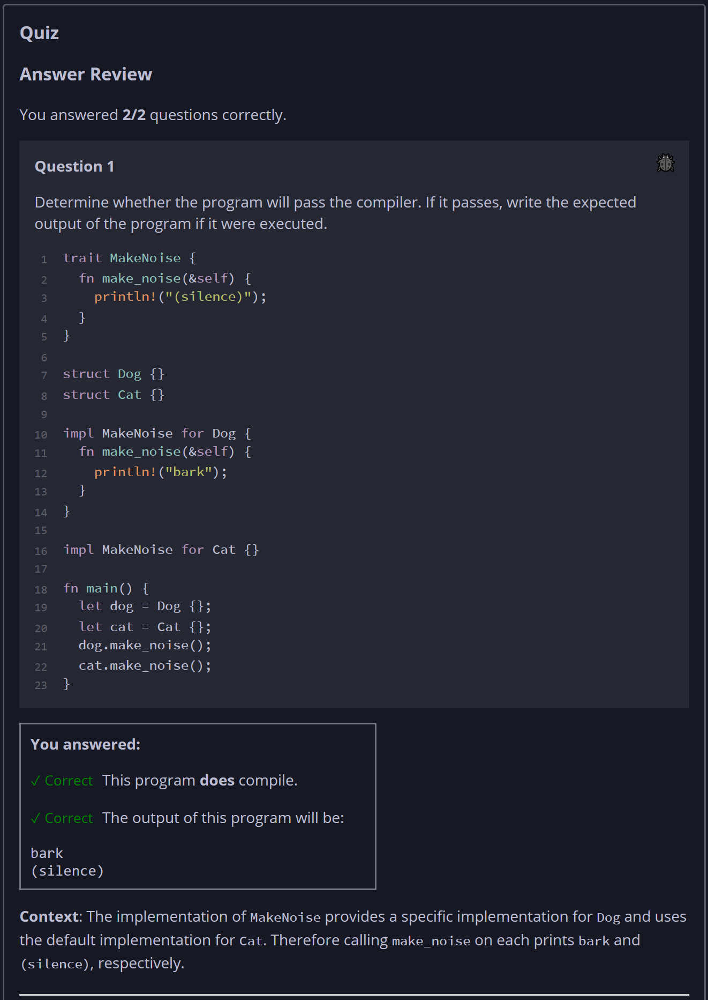
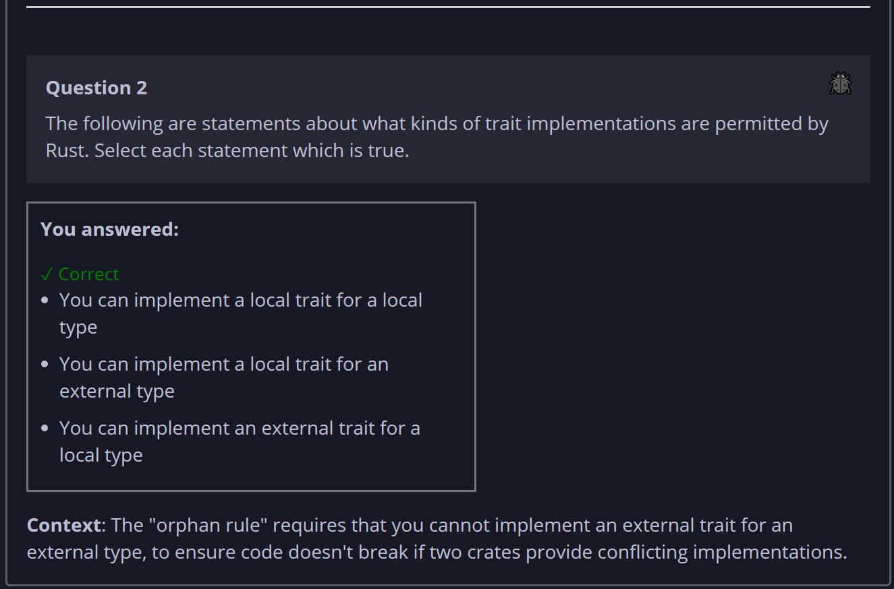

## Quiz - Chapter 10.2a ##

> **Question 1**<br>
> Determine whether the program will pass the compiler. If it 
> passes, write the expected output of the program if it were 
> executed.
> 
> ```rust
> trait MakeNoise {
>     fn make_noise(&self) {
>         println!("(silence)");
>     }
> }
> 
> struct Dog {}
> struct Cat {}
> 
> impl MakeNoise for Dog {
>     fn make_noise(&self) {
>         println!("bark");
>     }
> }
> 
> impl MakeNoise for Cat {}
> 
> fn main() {
>     let dog = Dog {};
>     let cat = Cat {};
>     dog.make_noise();
>     cat.make_noise();
> }
> ```
>
> > Response<br>
> > This program:<br>
> > ○ DOES compile<br>
> > ◉ Does NOT compile<br>
> > 
> > The output of this program will be:<br>
> > [<br>
> >  ```bark```<br>
> >  ```(silence)```<br>
> > ]
> > 
> ---
> 
> **Question 2**<br>
> The following are statements about what kinds of trait 
> implementations are permitted by Rust. Select each 
> statement which is true.
>
> > Response<br>
> > ☐ You can implement an external trait for an external 
> > type<br>
> > ☑ You can implement a local trait for an external type<br>
> > ☑ You can implement an external trait for a local type<br>
> > ☑ You can implement a local trait for a local type<br>
> >
> ---



