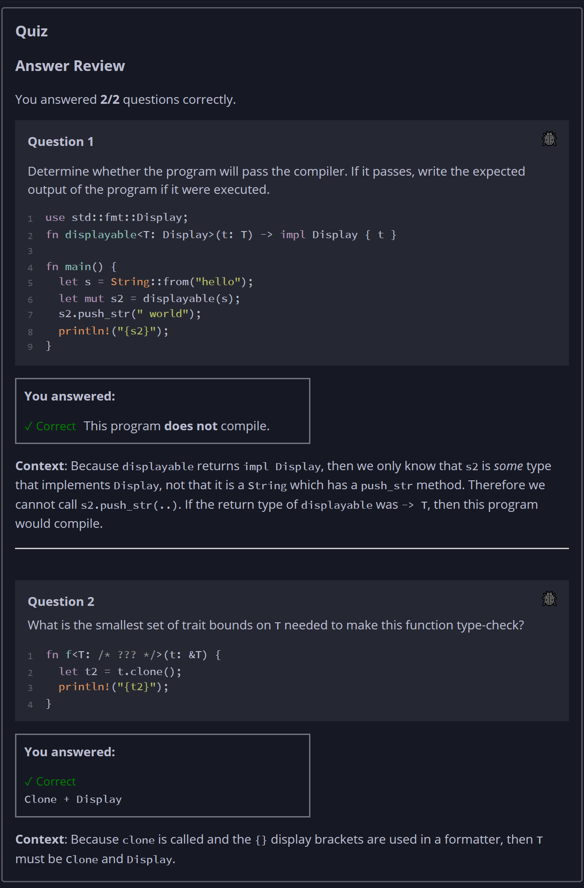

## Quiz - Chapter 10.2b ##

> **Question 1**<br>
> Determine whether the program will pass the compiler. If it 
> passes, write the expected output of the program if it were 
> executed.
>
> ```rust
> use std::fmt::Display;
> 
> fn displayable<T: Display>(t: T) -> impl Display { t }
> 
> fn main() {
>     let s = String::from("hello");
>     let mut s2 = displayable(s);
>     s2.push_str(" world");
>     println!("{s2}");
> }
> ```
>
> > Response<br>
> > This program:<br>
> > ○ DOES compile<br>
> > ◉ Does NOT compile<br>
> > 
> ---
>
> **Question 2**<br>
> What is the smallest set of trait bounds on T needed to 
> make this function type-check?
>
> ```rust
> fn f<T: /* ??? */>(t: &T) {
>     let t2 = t.clone();
>     println!("{t2}");
> }
> ```
>
> > Response<br>
> > ○ (no bounds)<br>
> > ○ Clone<br>
> > ◉ Clone + Display<br>
> > ○ Clone + Display + Debug<br>
> >
> ---


