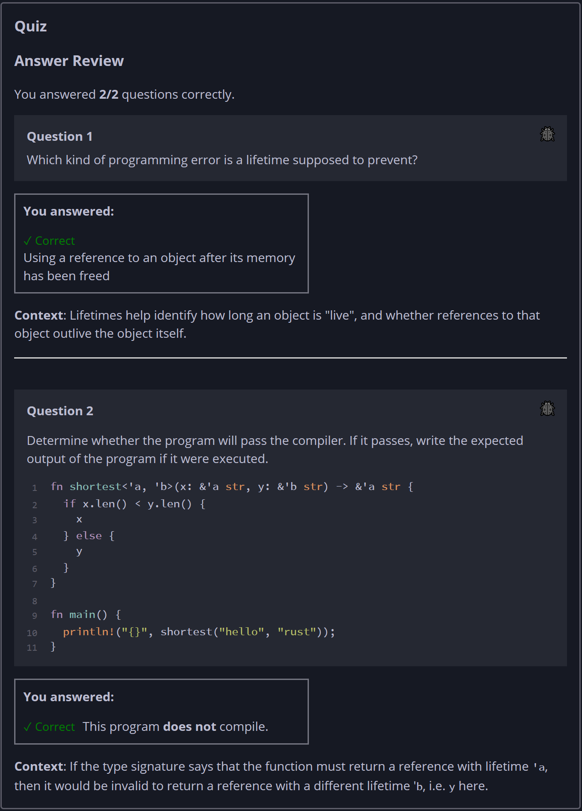

## Quiz - Chapter 10.3a ##

> **Question 1**<br>
> Which kind of programming error is a lifetime supposed to 
> prevent?
>
> > Response<br>
> > ○ Using the result of a fallible computation before 
> > checking for the possibility of error<br>
> > ○ Indexing past the bounds of an array (buffer overflow)
> > <br>
> > ◉ Using a reference to an object after its memory has 
> > been freed<br>
> > ○ Not allocating enough memory for an object<br>
> >
> ---
>
> **Question 2**<br>
> Determine whether the program will pass the compiler. If it 
> passes, write the expected output of the program if it were 
> executed.
>
> ```rust
> fn shortest<'a, 'b>(x: &'a str, y: &'b str) -> &'a str {
>     if x.len() < y.len() {
>         x
>     } else {
>         y
>     }
> }
> fn main() {
>     println!("{}", shortest("hello", "rust"));
> }
> ```
>
> > Response<br>
> > This program:<br>
> > ○ DOES compile<br>
> > ◉ Does NOT compile
> > 
> ---


