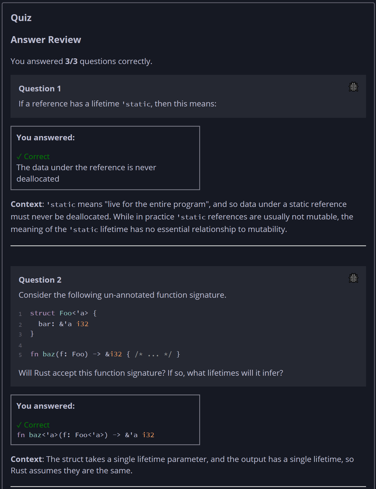
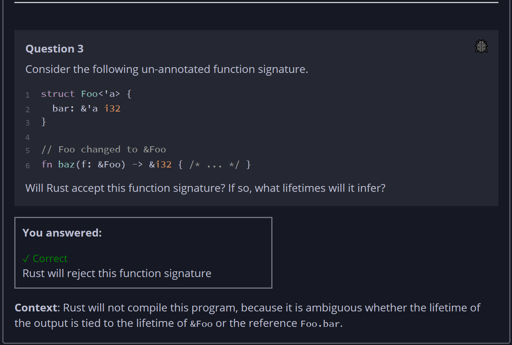

## Quiz - Chapter 10.3b ##

> **Question 1**<br>
> If a reference has a lifetime ```'static```, then this 
> means:
>
> > Response<br>
> > ○ The data under the reference lives in the static region 
> > of memory<br>
> > ○ The data under the reference cannot be mutated<br>
> > ◉ The data under the reference is never deallocated<br>
> > ○ The data under the reference is not dynamic<br>
> >
> ---
>
> **Question 2**<br>
> Consider the following un-annotated function signature.
>
> ```rust
> struct Foo<'a> {
>     bar: &'a i32
> }
> 
> fn baz(f: Foo) -> &i32 { /* ... */ }
> ```
> 
> Will Rust accept this function signature? If so, what 
> lifetimes will it infer?
>
> > Response<br>
> > ○ Rust will reject this function signature
> > 
> > ---
> > ○
> > ```rust
> > fn baz(f: Foo) -> &i32
> > ```
> > 
> > ---
> > ○
> > ```rust
> > fn baz<'a>(f: Foo<'a>) -> &i32
> > ```
> > 
> > ---
> > ○
> > ```rust
> > fn baz<'a>(f: Foo) -> &'a i32
> > ```
> > 
> > ---
> > ○
> > ```rust
> > fn baz<'a>(f: Foo<'a>) -> &'a i32
> > ```
> > 
> > ---
> >
> ---
>
> **Question 3**<br>
> Consider the following un-annotated function signature.
>
> ```rust
> struct Foo<'a> {
>     bar: &'a i32
> }
> 
> // Foo changed to &Foo
> fn baz(f: &Foo) -> &i32 { /* ... */ }
> ```
> 
> Will Rust accept this function signature? If so, what 
> lifetimes will it infer?
>
> > Response<br>
> > ◉ Rust will reject this function signature
> > 
> > ---
> > ○
> > ```rust
> > fn baz(f: &Foo) -> &i32
> > ```
> > 
> > ---
> > ○
> > ```rust
> > fn baz<'a>(f: &Foo<'a>) -> &'a i32
> > ```
> > 
> > ---
> > ○
> > ```rust
> > fn baz<'a>(f: &'a Foo) -> &'a i32
> > ```
> > 
> > ---
> > ○
> > ```rust
> > fn baz<'a, 'b>(f: &'a Foo<'b>) -> &'a i32
> > ```
> > 
> > ---
> > ○
> > ```rust
> > fn baz<'a, 'b>(f: &'a Foo<'b>) -> &'b i32
> > ```
> > 
> > ---
> >
> ---



