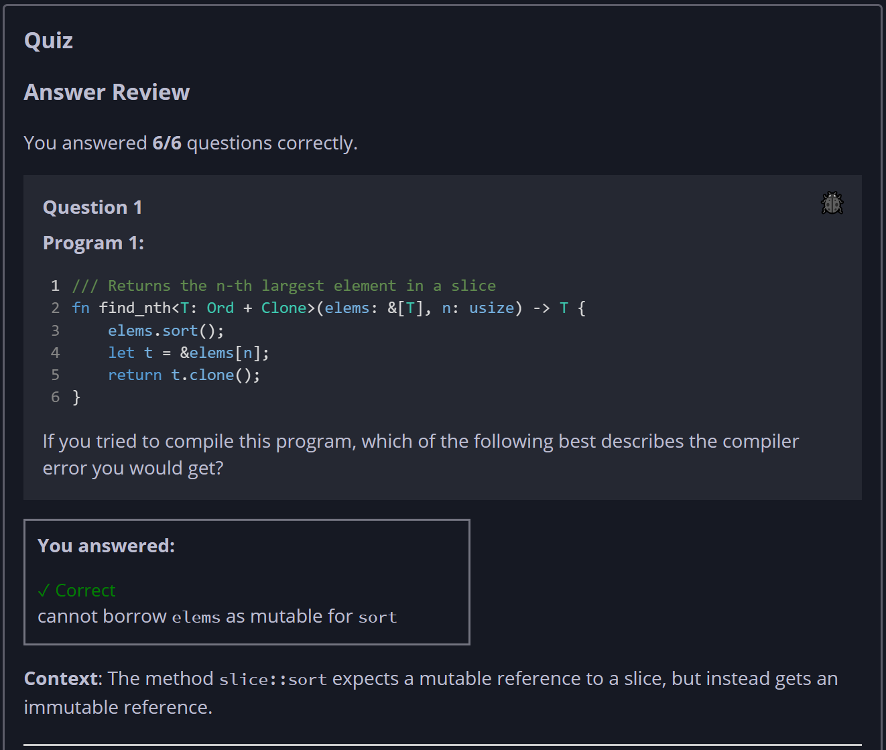
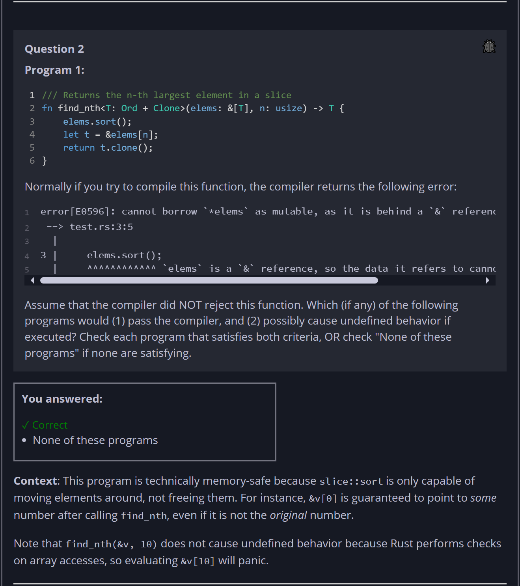
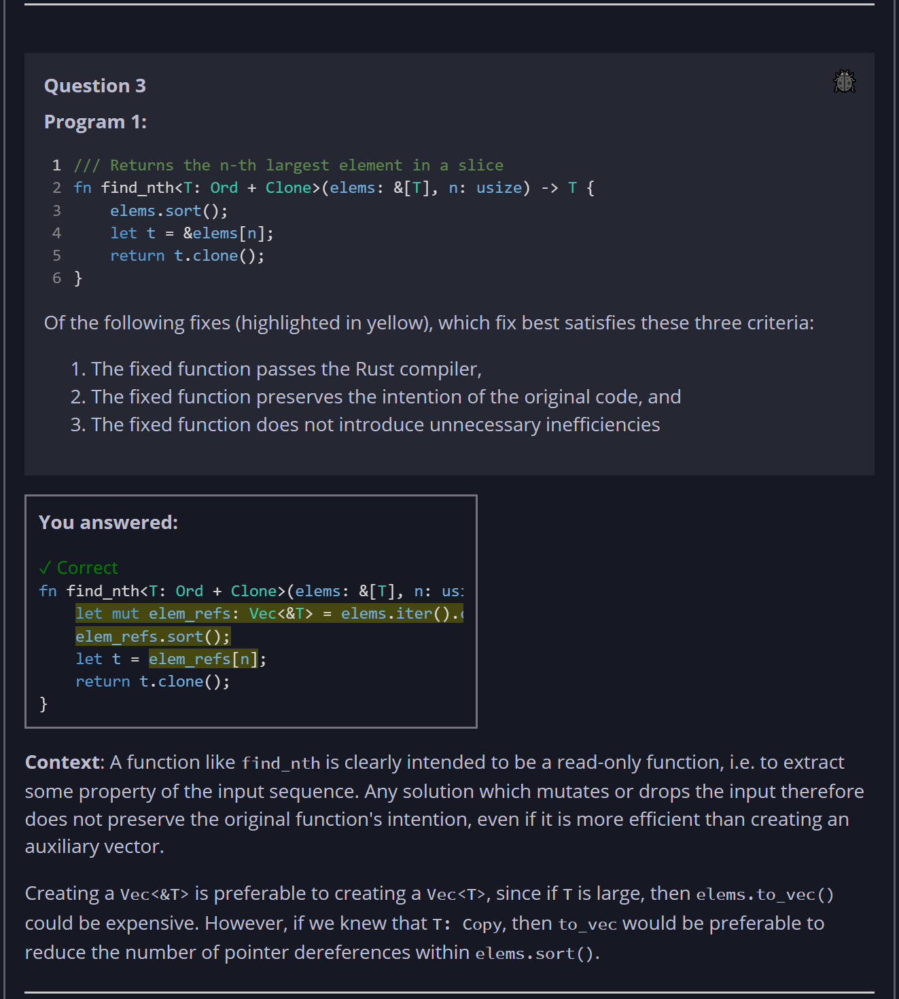
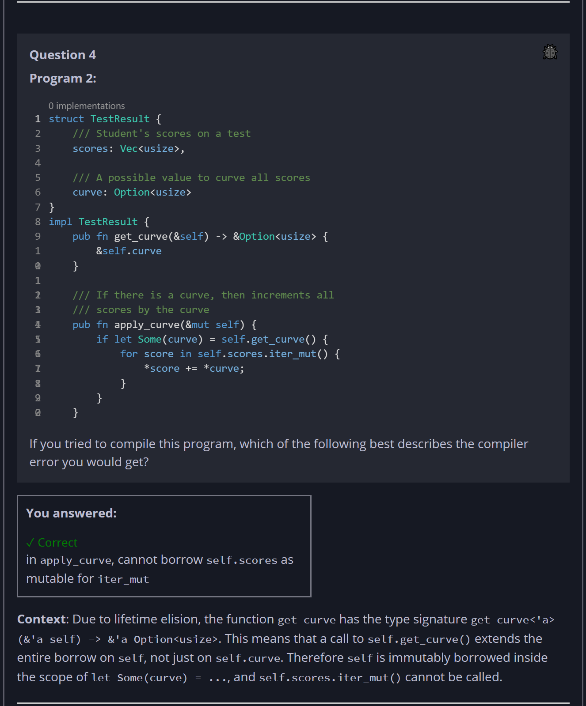
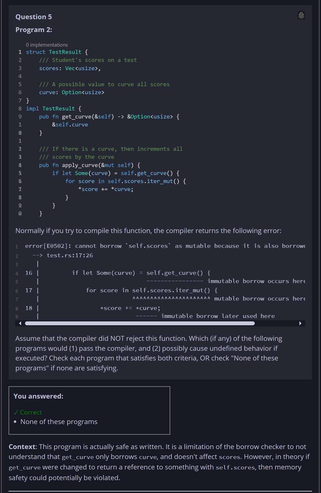
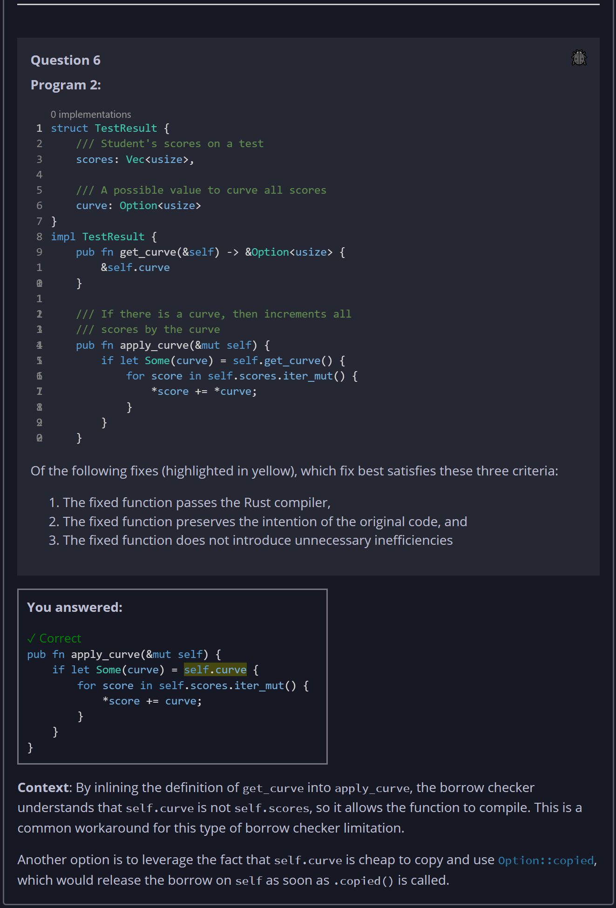

## Quiz - Chapter 10.4 - Ownership Inventory #3 ##

> **Question 1**<br>
> Program 1:
>
> ```rust
> /// Returns the n-th largest element in a slice
> fn find_nth<T: Ord + Clone>(elems: &[T], n: usize) -> T {
>     elems.sort();
>     let t = &elems[n];
>     return t.clone();
> }
> ```
> 
> If you tried to compile this program, which of the 
> following best describes the compiler error you would get?
>
> > Response<br>
> > ○ cannot move out of shared reference for ```clone```<br>
> > ○ the lifetime of ```T``` must outlive ```&[T]```<br>
> > ○ cannot move out of shared reference in expression
> > ```&elems[n]```<br>
> > ◉ cannot borrow ```elems``` as mutable for ```sort```<br>
> >
> ---
>
> **Question 2**<br>
> Program 1:
>
> ```rust
> /// Returns the n-th largest element in a slice
> fn find_nth<T: Ord + Clone>(elems: &[T], n: usize) -> T {
>     elems.sort();
>     let t = &elems[n];
>     return t.clone();
> }
> ```
> 
> Normally if you try to compile this function, the compiler 
> returns the following error: 
>
> ```
> error[E0596]: cannot borrow `*elems` as mutable, as it is behind a `&` reference
>  --> test.rs:3:5
>   |
> 3 |     elems.sort();
>   |     ^^^^^^^^^^^^ `elems` is a `&` reference, so the data it refers to cannot be borrowed as mutable
> ```
>
> Assume that the compiler did NOT reject this function. 
> Which (if any) of the following programs would (1) pass the 
> compiler, and (2) possibly cause undefined behavior if 
> executed? Check each program that satisfies both criteria, 
> OR check "None of these programs" if none are satisfying.
>
> > Response<br>
> > 
> > ☐
> > 
> > ```rust
> > let v = vec![5, 4, 3, 2, 1];
> > find_nth(&v, 10);
> > ```
> > 
> > ---
> > 
> > ☑ None of these programs
> > 
> > ---
> > 
> > ☐
> > 
> > ```rust
> > let v = vec![5, 4, 3, 2, 1];
> > let n = &v[0];
> > find_nth(&v, 0);
> > println!("{}", n);
> > ```
> > 
> > ---
> > 
> > ☐
> > 
> > ```rust
> > let v = vec![5, 4, 3, 2, 1];
> > find_nth(&v, 0);
> > println!("{}", v[0]);
> > ```
> > 
> > ---
> >
> ---
>
> **Question 3**<br>
> Program 1:
>
> ```rust
> /// Returns the n-th largest element in a slice
> fn find_nth<T: Ord + Clone>(elems: &[T], n: usize) -> T {
>     elems.sort();
>     let t = &elems[n];
>     return t.clone();
> }
> ```
> 
> Of the following fixes (highlighted in yellow), which fix 
> best satisfies these three criteria:
> 
> 1. The fixed function passes the Rust compiler,
> 2. The fixed function preserves the intention of the 
>    original code, and
> 3. The fixed function does not introduce unnecessary 
>    inefficiencies
>
> > Response<br>
> >
> > ◉ 
> > 
> > ```rust
> > fn find_nth<T: Ord + Clone>(elems: &[T], n: usize) -> T {
> >     let mut elem_refs: Vec<&T> = elems.iter().collect();
> >     elem_refs.sort();
> >     let t = elem_refs[n];
> >     return t.clone();
> > }
> > ```
> > 
> > ---
> >
> > ○ 
> > 
> > ```rust
> > fn find_nth<T: Ord + Clone>(elems: &[T], n: usize) -> T {
> >     let mut elems = elems.to_vec();
> >     elems.sort();
> >     let t = &elems[n];
> >     return t.clone();
> > }
> > ```
> > 
> > ---
> >
> > ○ 
> > 
> > ```rust
> > fn find_nth<T: Ord>(mut elems: Vec<T>, n: usize) -> T {
> >     elems.sort();
> >     let t = elems.remove(n);
> >     return t;
> > }
> > ```
> > 
> > ---
> >
> > ○ 
> > 
> > ```rust
> > fn find_nth<T: Ord + Clone>(elems: &mut [T], n: usize) -> T {
> >     elems.sort();
> >     let t = &elems[n];
> >     return t.clone();
> > }
> > ```
> > 
> > ---
>
> **Question 4**<br>
> Program 2:
>
> ```rust
> struct TestResult {
>     /// Student's scores on a test
>     scores: Vec<usize>,
> 
>     /// A possible value to curve all scores
>     curve: Option<usize>
> }
> 
> impl TestResult {  
>     pub fn get_curve(&self) -> &Option<usize> { 
>         &self.curve 
>     }
> 
>     /// If there is a curve, then increments all 
>     /// scores by the curve
>     pub fn apply_curve(&mut self) {
>         if let Some(curve) = self.get_curve() {
>             for score in self.scores.iter_mut() {
>                 *score += *curve;
>             }
>         }
>     }
> }
> ```
>
> If you tried to compile this program, which of the 
> following best describes the compiler error you would get?
>
> > Response<br>
> > ○ in ```get_curve```, cannot return a reference to a 
> > local variable ```self.curve```<br>
> > ○ in ```apply_curve```, ```*score``` cannot be mutated<br>
> > ○ in ```apply_curve```, cannot borrow ```self``` as 
> > immutable for ```get_curve```<br>
> > ◉ in ```apply_curve```, cannot borrow ```self.scores``` 
> > as mutable for ```iter_mut```<br>
> > 
> ---
>
> **Question 5**<br>
> Program 2:
>
> ```rust
> struct TestResult {
>     /// Student's scores on a test
>     scores: Vec<usize>,
> 
>     /// A possible value to curve all scores
>     curve: Option<usize>
> }
> 
> impl TestResult {  
>     pub fn get_curve(&self) -> &Option<usize> { 
>         &self.curve 
>     }
> 
>     /// If there is a curve, then increments all 
>     /// scores by the curve
>     pub fn apply_curve(&mut self) {
>         if let Some(curve) = self.get_curve() {
>             for score in self.scores.iter_mut() {
>                 *score += *curve;
>             }
>         }
>     }
> }
> ```
>
> Normally if you try to compile this function, the compiler 
> returns the following error:
>
> ```
> error[E0502]: cannot borrow `self.scores` as mutable because it is also borrowed as immutable
>   --> test.rs:17:26
>    |
> 16 |         if let Some(curve) = self.get_curve() {
>    |                              ---------------- immutable borrow occurs here
> 17 |             for score in self.scores.iter_mut() {
>    |                          ^^^^^^^^^^^^^^^^^^^^^^ mutable borrow occurs here
> 18 |                 *score += *curve;
>    |                           ------ immutable borrow later used here
> ```
>
> Assume that the compiler did NOT reject this function. 
> Which (if any) of the following programs would (1) pass the 
> compiler, and (2) possibly cause undefined behavior if 
> executed? Check each program that satisfies both criteria, 
> OR check "None of these programs" if none are satisfying.
>
> > Response<br>
> > 
> > 
> > ☑ None of these programs
> > 
> > ---
> > 
> > ☐
> > 
> > ```rust
> > let mut result = TestResult { 
> >     scores: vec![20, 50, 30], 
> >     curve: Some(10) 
> > };
> > let x = &result.scores[0];
> > result.apply_curve();
> > println!("{}", x);
> > ```
> > 
> > ---
> > 
> > ☐
> > 
> > ```rust
> > let mut result = TestResult { 
> >     scores: vec![20, 50, 30], 
> >     curve: Some(10) 
> > };
> > result.apply_curve();
> > println!("{:?}", result.scores);
> > ```
> > 
> > ---
> > 
> > ☐
> > 
> > ```rust
> > let mut result = TestResult { 
> >     scores: vec![20, 50, 30], 
> >     curve: Some(10) 
> > };
> > result.apply_curve();
> > ```
> > 
> > ---
> >
> ---
>
> **Question 6**<br>
> Program 2:
>
> ```rust
> struct TestResult {
>     /// Student's scores on a test
>     scores: Vec<usize>,
> 
>     /// A possible value to curve all scores
>     curve: Option<usize>
> }
> 
> impl TestResult {  
>     pub fn get_curve(&self) -> &Option<usize> { 
>         &self.curve 
>     }
> 
>     /// If there is a curve, then increments all 
>     /// scores by the curve
>     pub fn apply_curve(&mut self) {
>         if let Some(curve) = self.get_curve() {
>             for score in self.scores.iter_mut() {
>                 *score += *curve;
>             }
>         }
>     }
> }
> ```
> 
> Of the following fixes (highlighted in yellow), which fix 
> best satisfies these three criteria:
> 
> 1. The fixed function passes the Rust compiler,
> 2. The fixed function preserves the intention of the 
>    original code, and
> 3. The fixed function does not introduce unnecessary 
>    inefficiencies
>
> > Response<br>
> >
> > ◉ 
> > 
> > ```rust
> > pub fn apply_curve(&mut self) {
> >     if let Some(curve) = self.get_curve() {
> >         for score in self.scores.clone().iter_mut() {
> >             *score += *curve;
> >         }
> >     }
> > }
> > ```
> > 
> > ---
> >
> > ○ 
> > 
> > ```rust
> > pub fn apply_curve(&mut self) {
> >     if let Some(curve) = self.get_curve() {
> >         for score in self.scores.iter() {
> >             *score += *curve;
> >         }
> >     }
> > }
> > ```
> > 
> > ---
> >
> > ◉
> > 
> > ```rust
> > pub fn apply_curve(&mut self) {
> >     if let Some(curve) = self.curve {
> >         for score in self.scores.iter_mut() {
> >             *score += curve;
> >         }
> >     }
> > }
> > ```
> > 
> > ---
> >
> > ○ 
> > 
> > ```rust
> > pub fn apply_curve(&mut self) {
> >     if let Some(curve) = self.get_curve().as_ref() {
> >         for score in self.scores.iter_mut() {
> >             *score += *curve;
> >         }
> >     }
> > }
> > ```
> > 
> > ---
> >
> ---







