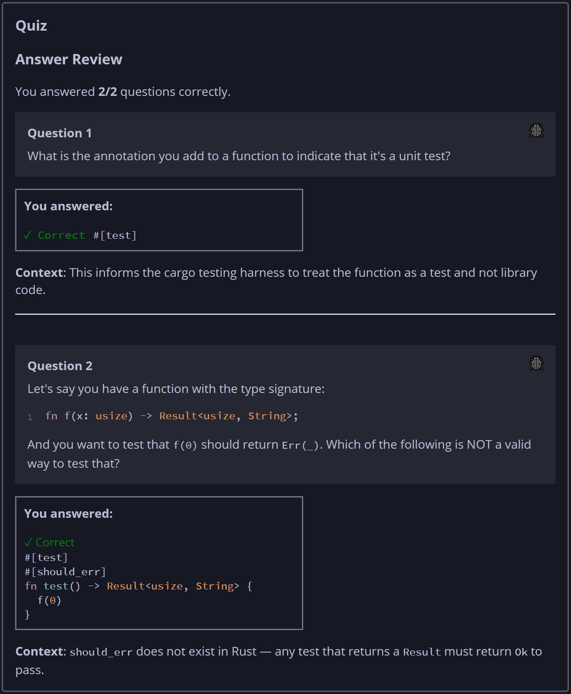

## Quiz - Chapter 11.1 ##

> **Question 1**<br>
> What is the annotation you add to a function to indicate 
> that it's a unit test?
>
> > Response<br>
> > [ ```#[test]``` ]
> >
> ---
>
> **Question 2**<br>
> Let's say you have a function with the type signature:
> 
> ```rust
> fn f(x: usize) -> Result<usize, String>;
> ```
> And you want to test that f(0) should return Err(_). Which 
> of the following is NOT a valid way to test that?
>
> > Response<br>
> > 
> > ○
> > ```rust
> > #[test]
> > #[should_panic]
> > fn test() { 
> >     f(0).unwrap();
> > }
> > ```
> > 
> > ---
> > 
> > ○
> > ```rust
> > #[test]
> > fn test() {
> >     assert!(f(0).is_err());
> > }
> > ```
> > 
> > ---
> > 
> > ○
> > ```rust
> > #[test]
> > fn test() {
> >   assert!(match f(0) {
> >     Ok(_) => false,
> >     Err(_) => true
> >   });  
> > }
> > ```
> > 
> > ---
> > 
> > ◉
> > ```rust
> > #[test]
> > #[should_err]
> > fn test() -> Result<usize, String> {
> >   f(0)
> > }
> > ```
> > 
> > ---
> >
> ---


