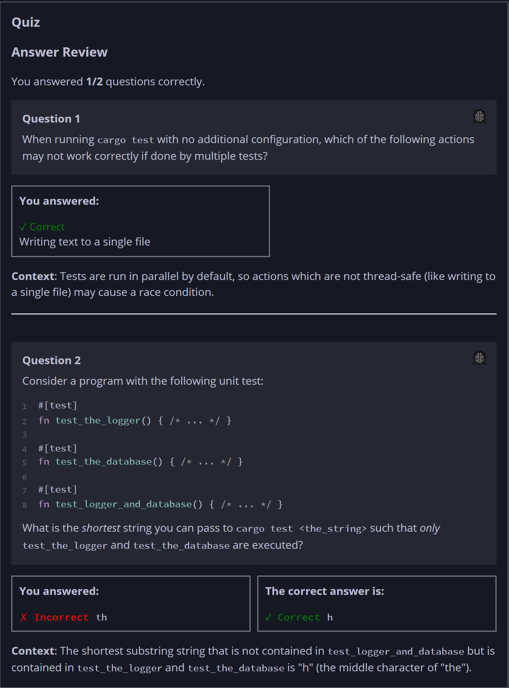

## Quiz - Chapter 11.2 ##

> **Question 1**<br>
> When running cargo test with no additional configuration, which of the 
> following actions may not work correctly if done by multiple tests?
>
> > Response<br>
> > 
> > ○ Failing via panics
> > ◉ Writing text to a single file
> > ○ Reading data from a single database
> > ○ Logging strings to stdout
> >
> ---
>
> **Question 2**<br>
> Consider a program with the following unit test:
> ```rust
> #[test]
> fn test_the_logger() { /* ... */ }
> #[test]
> fn test_the_database() { /* ... */ }
> #[test]
> fn test_logger_and_database() { /* ... */ }
> ```
>
> What is the *shortest* string you can pass to 
> ```cargo test <the_string>``` such that only ```test_the_logger```
> and ```test_the_database``` are executed?
> 
> > Response<br>
> > [```h```]
> 
> ---


