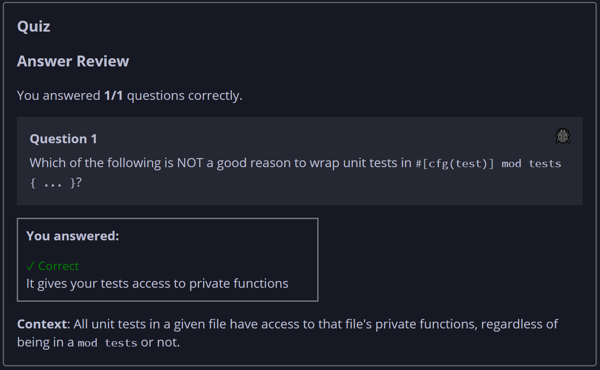

## Quiz - Chapter 11.3 ##

> **Question 1**<br>
> Which of the following is NOT a good reason to wrap unit tests in
> ```#[cfg(test)] mod tests { ... }?```
>
> > Response<br>
> > 
> > ○ It can improve compile times
> > ◉ It gives your tests access to private functions
> > ○ It can reduce the size of generated compiler artifacts
> > ○ It separates test helper functions from library code
> >
> ---


