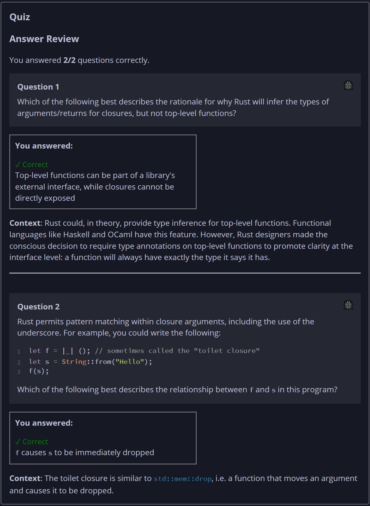

## Quiz - Chapter 13.1 ##

> **Question 1**<br>
> Which of the following best describes the rationale for why Rust will 
> infer the types of arguments/returns for closures, but not top-level 
> functions?
>
> > Response:<br>
> > 
> > ○ Anything assignable to a variable can be type-inferred, and 
> >   top-level functions cannot be assigned to a variable<br>
> > ○ Due to the halting problem, it is mathematically impossible for Rust 
> >   to infer the types of top-level functions<br>
> > ◉ Top-level functions can be part of a library's external interface, 
> >   while closures cannot be directly exposed<br>
> > ○ For backwards compatibility with older versions of Rust<br>
> >
> ---
>
> **Question 2**<br>
> Rust permits pattern matching within closure arguments, including the 
> use of the underscore. For example, you could write the following:
> ```rust
> let f = |_| (); // sometimes called the "toilet closure"
> let s = String::from("Hello");
> f(s);
> ```
>
> Which of the following best describes the relationship between f and s 
> in this program?
>
> > Response<br>
> > ◉ ```f``` causes ```s``` to be immediately dropped<br>
> > ○ ```f``` reads ```s``` and then throws away the result<br>
> > ○ ```f``` has no effect on ```s```<br>
> > ○ ```f``` captures ```s``` in its environment<br>
> ---
> 


